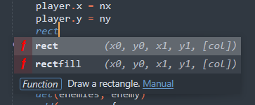

# PICO-8 - Sublime Text Completion



**Work In Progress**

PICO-8 plugin for the Sublime Text 4 editor.

<small>Based on https://github.com/Neko250/sublime-PICO-8 and https://github.com/sublimehq/Packages/tree/master/Lua</small>


## Features

- Full API completion
- Useful snippets
- _No ugly color scheme_
- _No ugly font_

## Installation

### Git

1. In Sublime Text: Command Palette > "Preferences: Browse Packages"
1. Open a terminal and `cd` into this directory
1. Clone the repository:
```sh
git clone https://github.com/scambier/PICO-8-Sublime PICO-8
```

### Manual installation

1. Download the files using the GitHub `.zip` download option.
1. Unzip the files and rename the folder to `PICO-8`
1. In Sublime Text: Command Palette > "Preferences: Browse Packages"
1. Copy the `PICO-8` folder inside the `Packages` directory.
